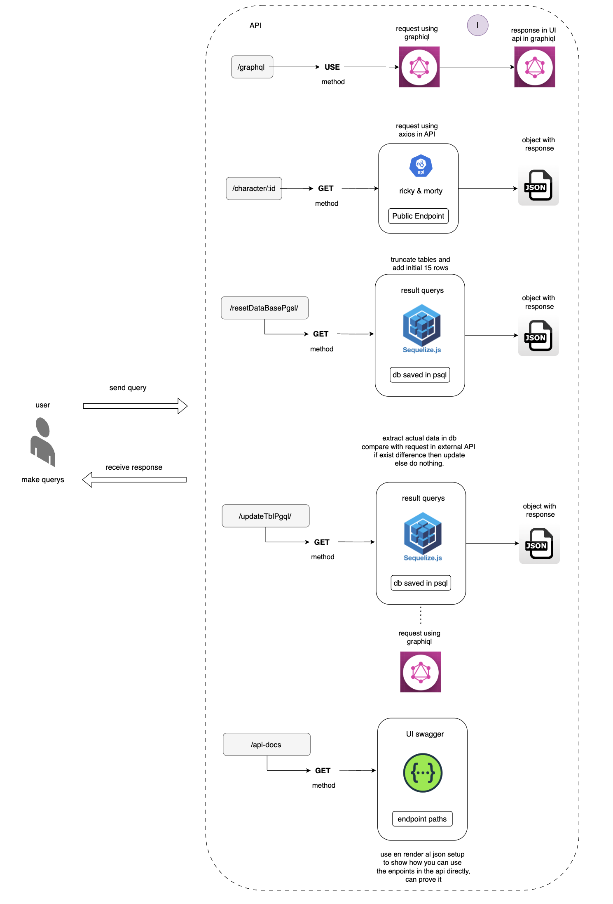

# Blossom Assessment Case: Backend Developer

## Flujo de Desarrollo

En el desarrollo de la API, se tuvieron en cuenta aspectos relacionados con ciertas validaciones en torno al uso de las rutas propuestas en el constructor de la app en Express. A continuación, se presenta el diagrama que permite identificar las rutas dispuestas en el servidor, así como el flujo de desarrollo que representa cada una.



## Descripción del Diagrama

El diagrama ilustra las siguientes rutas y su flujo:

- **Ruta 1:** `/graphql`
  - Se dispone principalmente para realizar consultas con la interface de usuario de graphql.
- **Ruta 2:** `/caharcter/:id`
  - Se dispone para realizar consultas al servicio de API externa y poder extraer con base a un id, unicamente los atributos seleccionados.
- **Ruta 3:** `/resetDataBasePgsl/`
  - Descripción de lo que hace la ruta 3.

## Validaciones Implementadas

- **Validación 1:** Descripción de la validación 1.
- **Validación 2:** Descripción de la validación 2.
- **Validación 3:** Descripción de la validación 3.

## Ejemplo de Uso

Aquí hay un ejemplo de cómo usar la API:

```bash
curl -X GET http://tuservidor.com/ruta1

