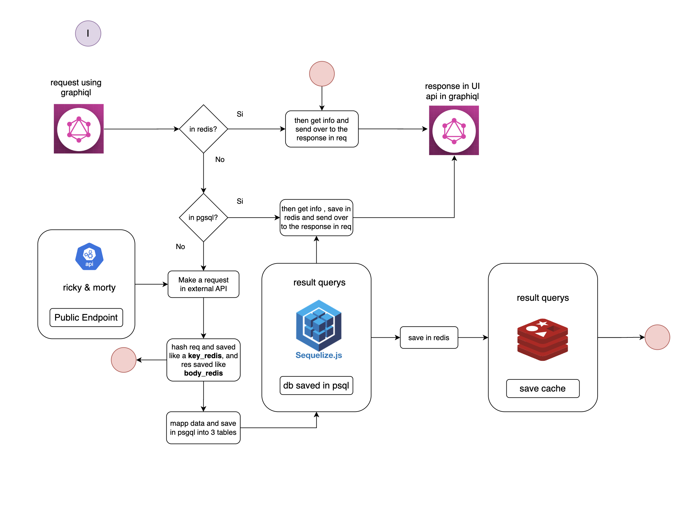

# Blossom Assessment Case: Backend Developer

## Flujo de Desarrollo

En el desarrollo de la API, se tuvieron en cuenta aspectos relacionados con ciertas validaciones en torno al uso de las rutas propuestas en el constructor de la app en Express. A continuación, se presenta el diagrama que permite identificar las rutas dispuestas en el servidor, así como el flujo de desarrollo que representa cada una.

### Diagrama de rutas en la API.


## Descripción del Diagrama: 1

El diagrama ilustra las siguientes rutas y su flujo:

- **Ruta 1:** `/graphql`
  - Se dispone principalmente para realizar consultas con la interface de usuario de graphql.
- **Ruta 2:** `/caharcter/:id`
  - Se dispone para realizar consultas al servicio de API externa y poder extraer con base a un id, unicamente los atributos seleccionados.
- **Ruta 3:** `/resetDataBasePgsl/`
  - Se dispone la ruta para truncar la base de caracteres extraidos (BLOSSOM_TblCharacters) y podarla con 15 datos extraidos de la API externa.
- **Ruta 4:** `/updateTblPgql/`
  - Se dispone la ruta para realizar la actualización de la base de caracteres extraidos (BLOSSOM_TblCharacters) si y solo si ha cambiado los datos.
- **Ruta 4:** `/api-docs`
  - Se dispone la ruta para revisar el UI de swagger entorno al compendio de endpoints o rutas activas; poder probarlas y leer documentación adicional de las salidas.


### Diagrama de flujo de consulta en API.



## Descripción del Diagrama: 2

El diagrama ilustra las siguientes rutas y su flujo:

- **middleware : queryValidationExist**  ==> `src/middlewares/queryValidatorMiddleware.ts`
  - Encargado principalmente de validar si el hash (el cuerpo de la solicitud) ya se ha trabajando anteriormente y se puede entregar en al request (caché.) ; sino esta en redis entonces valida si se encuentra en postgres si está entonces que guarde la informacion en redis y que entregue la información consultada en postgres en respuesta a la solicitud, finalmente si pudo encontrar información en el storage de postgres ni en caché, entonces que invoque **NextFunction** para pasar al siguiente Middleware.<br><br>
- **middleware : queryCustodianMiddleware**  ==> `src/middlewares/queryCustodianMiddleware.ts`
  - Recibiendo el cuerpo de la solicitud de query, se realiza la consulta en la ruta de `/graphql` y por consiguiente se almacena en redis con key del hash, se toman el objeto de respuesta de la solicitud, se mapea con fucniones asincronicas del modelo de bases de datos de migración y se migran a la base en postgres usando el protocolo `sequelize-typescript`. <br><br>
- **middleware : queryValidationExist**  ==> `src/middlewares/queryValidatorMiddleware.ts`
  - Encargado principalmente de validar si el hash (el cuerpo de la solicitud) ya se ha trabajando anteriormente y se puede entregar en al request (caché.) ; sino esta en redis entonces valida si se encuentra en postgres si está entonces que guarde la informacion en redis y que entregue la información consultada en postgres en respuesta a la solicitud, finalmente si pudo encontrar información en el storage de postgres ni en caché, entonces que invoque **NextFunction** para pasar al siguiente Middleware.


## Validaciones Implementadas

- **Validación 1:** Descripción de la validación 1.
- **Validación 2:** Descripción de la validación 2.
- **Validación 3:** Descripción de la validación 3.

## Ejemplo de Uso

Aquí hay un ejemplo de cómo usar la API:

```bash
curl -X GET http://tuservidor.com/ruta1

